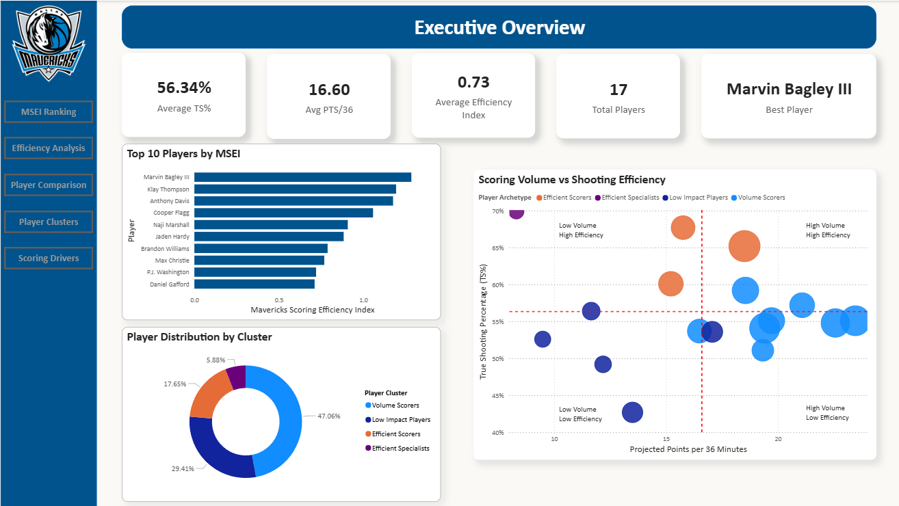
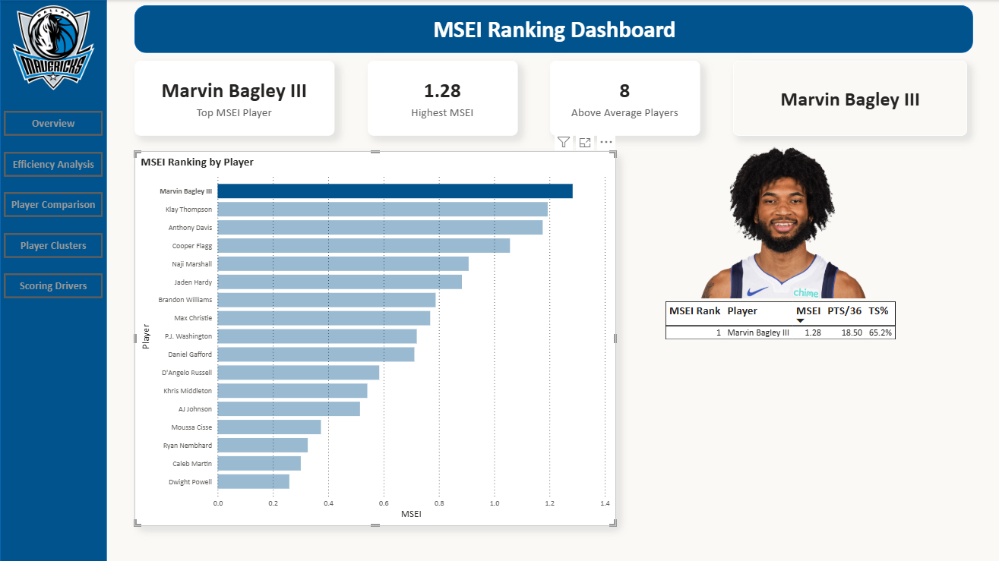
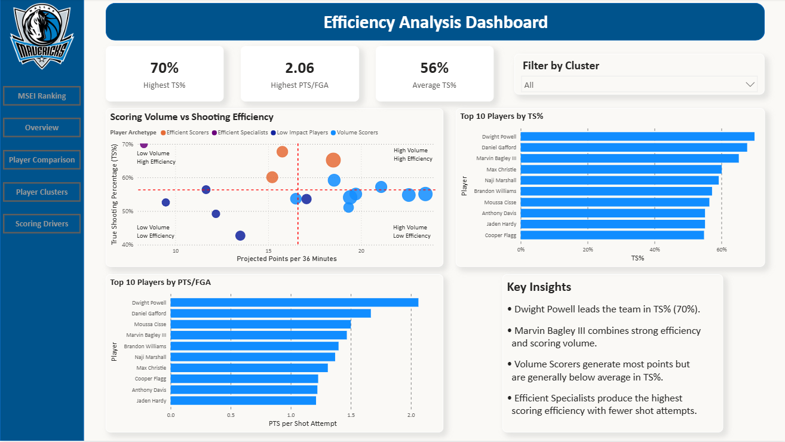
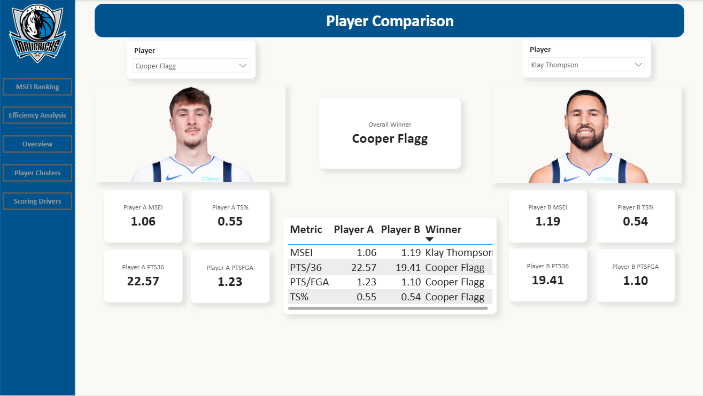
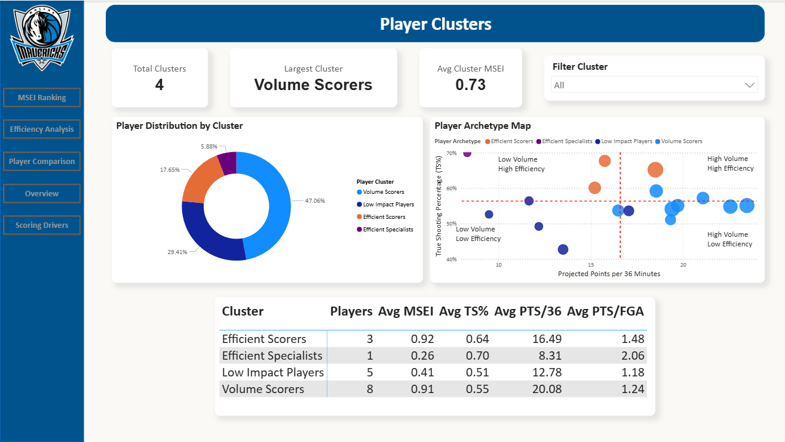
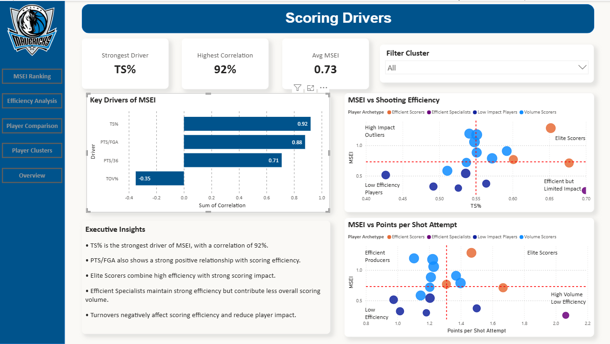

# Dallas Mavericks Player Scoring Efficiency Analysis

## Overview

This project analyzes scoring efficiency for the 2025-2026 Dallas Mavericks roster using player-level performance data from Basketball Reference.

The goal of the project is to move beyond traditional box score statistics and evaluate how efficiently players generate offense. To support this analysis, a custom metric called Mavericks Scoring Efficiency Index (MSEI) was developed by combining shooting efficiency, scoring volume, and shot creation indicators.

The project uses Python for data preparation and feature engineering and Power BI for dashboard development and visualization.

Key objectives:

* Analyze player scoring efficiency across the roster
* Identify the most efficient offensive contributors
* Compare players using advanced scoring metrics
* Understand relationships between scoring volume and efficiency
* Group players into scoring archetypes using cluster analysis

The final dashboard consists of six analytical pages:

1. Team Overview
2. Efficiency Analysis
3. MSEI Ranking
4. Scoring Drivers
5. Player Comparison
6. Player Clusters

---

## Dataset

Source:

https://www.basketball-reference.com/teams/DAL/2026.html

Data was collected from multiple Dallas Mavericks statistical tables available on Basketball Reference, including:

* Per Game Statistics
* Per 36 Minutes Statistics
* Shooting Statistics
* Advanced Statistics
* Adjusted Shooting Statistics
* Play-by-Play Statistics
* Per 100 Possession Statistics

After data collection, the datasets were cleaned and merged into a single analytical table for dashboard development.

Final analytical dataset fields include:

* Player
* Age
* Minutes Played
* Points Per Game
* True Shooting Percentage (TS%)
* Turnover Percentage (TOV%)
* Projected Points Per 36 Minutes
* Points Per Field Goal Attempt
* TS Impact
* MSEI
* Cluster
* Cluster Name

---

## Dashboard Preview

### Team Overview



Provides a high-level summary of team scoring efficiency, player rankings, and key performance indicators.

---

### MSEI Ranking



Ranks players based on the custom MSEI metric and highlights top performers.

---

### Efficiency Analysis



Examines scoring efficiency across players using TS%, Points per FGA, and MSEI.

---

### Player Comparison



Allows side-by-side comparison of selected players across multiple performance measures.

---

### Player Clusters



Groups players into scoring archetypes based on efficiency and scoring volume.

---

### Scoring Drivers



Explores relationships between scoring metrics and overall scoring efficiency.

---

## Tools and Technologies

* Python
* Pandas
* NumPy
* Jupyter Notebook
* Power BI
* DAX
* Git
* GitHub

---

## Repository Structure

```text
dataset/
├── raw/
├── cleaned/

notebooks/
├── Dallas Mavericks Player Scoring Efficiency Analysis.ipynb

dashboards/
├── Dallas_Mavericks_dashboards.pbix
├── screenshot/

output/
├── Dallas Mavericks Player Scoring Efficiency Analysis.html
```

---

## Author

Siripaiboon Janpetch

Master of Science in Data Analytics

The University of Texas at San Antonio
